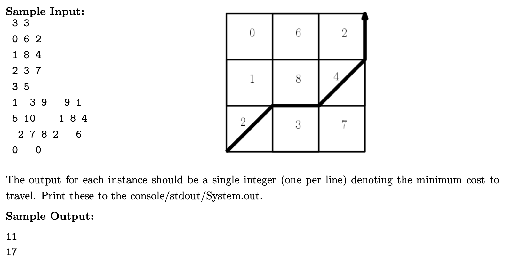

# Assignment One
Make a program which finds the shortest path between two points using only the corners of the tiles



## Thoughts
* Lets imagine each edge is a tower and from any tower next to each other which aren't diangles, we have 2 paths. One of those paths will be shorter than the other
  * So lets start with a base case of ignoring diangles 
* So how can we check what to tiles there could be

## Versions
### v0.0.1
run command
```
python hcam630.py < ./tests/sample-text.txt 
```

Output
```
(4, 4, [[0, 6, 2], [1, 8, 4], [2, 3, 7]])
[((1, 4), 1), ((1, 3), 1), ((0, 3), 1)]
(4, 6, [[1, 3, 9, 9, 1], [5, 10, 1, 8, 4], [2, 7, 8, 2, 6]])
[((1, 4), 1), ((1, 3), 1), ((0, 3), 1)]
```

The First line is the map in the format
```
(width, height, [[ (0,1), (0,2), (0,3) .... (0, width) ], [1,1), (1,2), (1,3) .... (1, width)],
....
[ (0,1), (0,2), (0,3) .... (height, width)] ])
```

The second-th lines are the option paths from position (0, height) aka the bottom left